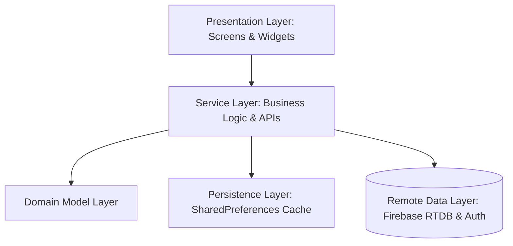

# MotiveMe — Mobile & Web Skill Tracker

MotiveMe is a premium cross-platform Flutter application designed to help users define, track, and complete daily skills and habits. The application features a robust real-time synchronization layer powered by Firebase, offline persistence for uninterrupted usage, achievements/gamification, and a comprehensive cross-platform test architecture.

---

## 🏗️ Layered Architecture Overview

MotiveMe is built on a clean, decoupled **Layered Architecture** designed to isolate business logic, data models, persistence layers, and UI presentation components. This separation of concerns ensures high testability, maintenance predictability, and seamless platform-independent operations.



### 📁 Architecture Components

1. **Domain Model Layer (`lib/Models/`)**:
   Pure Dart data classes defining the core business structures (e.g., `UserModel`, `Activity`, `UserActivity`, `Achievement`). These are independent of any UI or backend framework and handle serialization (`toMap`/`fromMap`) and key computations (like check-in availability or progress calculations).

2. **Persistence/Local Cache Layer (`lib/Local/`)**:
   Wraps local storage APIs (`shared_preferences`) to manage local caching of user profiles, offline skill registries, and achievement states. It facilitates immediate startup and a smooth offline fallback experience.

3. **Service Layer (`lib/Services/`)**:
   Orchestrates core app business logic, network checking, and Firebase Database/Auth synchronization. All Firebase services support **Constructor Dependency Injection** (`db`, `auth`, `userLocal`), allowing automated tests to inject mocks and run in pure unit test sandboxes.

4. **Presentation Layer (`lib/Screen/`)**:
   Constructs responsive widgets, visual states, page layouts, and user interactions utilizing `Material Design 3` color schemes and customized animations.

---

## 🗺️ Project Directory & Test Map

Below is a complete file and path map linking all production modules under `lib/` to their respective widget, unit, and E2E integration test scripts.

```
motiveme/
├── lib/                             # 🚀 Production Code base
│   ├── main.dart                    # App Entrypoint, Router & SplashGate
│   ├── Assets/
│   │   └── app_colors.dart          # Palette Tokens (AppColors)
│   ├── Models/                      # Domain Data Models
│   │   ├── achievement_model.dart
│   │   ├── activity_model.dart
│   │   ├── user_activity_model.dart
│   │   └── user_model.dart
│   ├── Local/                       # Local Cache & Persistence Layer
│   │   ├── achievement_local.dart
│   │   ├── skill_entries_local.dart
│   │   └── user_local.dart
│   ├── Services/                    # Business Logic, Firebase RTDB & Auth
│   │   ├── database_service.dart
│   │   ├── firebase_achievements_service.dart
│   │   ├── firebase_activity_service.dart
│   │   ├── firebase_skill_service.dart
│   │   ├── firebase_user_profile_service.dart
│   │   └── network_service.dart
│   └── Screen/                      # Presentation Layer (UI Screens)
│       ├── create_skill_screen.dart
│       ├── edit_profile_screen.dart
│       ├── home_screen.dart
│       ├── login_screen.dart
│       ├── profile_screen.dart
│       └── signup_screen.dart
│
├── test/                            # 🧪 Unit & Widget Test Suites
│   ├── unit/                        # Pure Unit Tests (Isolated logic)
│   │   ├── models/
│   │   │   ├── achievement_model_test.dart
│   │   │   ├── activity_model_test.dart
│   │   │   ├── user_activity_model_test.dart
│   │   │   └── user_model_test.dart
│   │   ├── local/
│   │   │   ├── achievement_local_test.dart
│   │   │   ├── skill_entries_local_test.dart
│   │   │   └── user_local_test.dart
│   │   └── services/
│   │       ├── database_service_test.dart
│   │       ├── firebase_achievements_service_test.dart
│   │       ├── firebase_activity_service_test.dart
│   │       ├── firebase_skill_service_test.dart
│   │       ├── firebase_user_profile_service_test.dart
│   │       ├── network_service_test.dart
│   │       └── validation_helper_test.dart
│   └── widget/                      # Component & UI Flow Mock Tests
│       ├── create_skill_screen_test.dart
│       ├── edit_profile_screen_test.dart
│       ├── home_screen_test.dart
│       ├── login_screen_test.dart
│       ├── profile_screen_test.dart
│       └── signup_screen_test.dart
│
└── integration_test/                # 🏁 Real-World E2E Integration Tests
    ├── app_test.dart                # Basic E2E verification
    ├── app_bva_test.dart            # Boundary Value & validation E2E
    └── app_intregration_test.dart   # Full 10-Step E2E flow
```

---

## ⚡ Running & Verifying Tests

We provide an interactive test runner script located in `scripts/test.sh` to compile, isolate, and execute all tests across platforms.

### 1. Service Unit & Screen Widget Tests (Pure sandboxed Dart environment)
No active device or simulator is needed for these tests. They are completely sandboxed.

* **Run all Unit and Widget tests**:
  ```bash
  ./scripts/test.sh all
  ```
* **Run service unit tests specifically** (Verifies 100% of all 182 service APIs/database/auth mocks):
  ```bash
  ./scripts/test.sh unit:services
  ```
* **Run widget tests specifically** (Verifies form validations, dialog overlays, layout elements):
  ```bash
  ./scripts/test.sh widget
  ```
* **Run single feature tests** (e.g., login views):
  ```bash
  ./scripts/test.sh feature:login
  ```

### 2. E2E Integration Tests (Requires connected emulator/device or Chrome web driver)

#### **Android Emulator (Mobile Integration)**
Ensure your emulator is booted and connected (e.g., `emulator-5554` or inspect using `flutter devices`).

* **Run the comprehensive E2E integration test**:
  ```bash
  ./scripts/test.sh integration -d emulator-5554
  ```
  *(Runs Mobile tests covering boundary validations, app startup redirects, and full 10-step authentication/crud cycles).*

#### **Chrome Browser (Web Integration)**
Ensure `chromedriver` is extracted and running on your host to allow Flutter to control the web driver.

1. **Extract and launch Chromedriver**:
   ```bash
   chmod +x chromedriver-mac-arm64/chromedriver
   ./chromedriver-mac-arm64/chromedriver --port=4444 &
   ```
2. **Run E2E tests on Chrome**:
   ```bash
   ./scripts/test.sh integration:web
   ```
   *(Compiles target tests in release mode to bypass local network port bindings and successfully runs them inside Google Chrome browser).*
